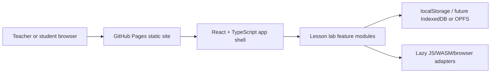

# Open School Lab

Live site: https://baditaflorin.github.io/open-school-lab/

Browser-based science, math, and engineering labs for classrooms without physical equipment.

Open School Lab is a Mode A GitHub Pages app: no backend, no accounts, no secrets. It ships twelve lesson-aligned simulation and visualization workbenches with lazy runtime boundaries for tools such as ngspice, Spice3, libigl, Pyodide/SymPy/SciPy/matplotlib, 3Dmol.js, Phaser physics, ImageJ-style processing, Open Babel, LilyPond, GraphViz, p5.js, tracker.js, and WebGPU compute.

## Quickstart

```sh
npm install
make install-hooks
make dev
make test
make build
```

## Scripts

```sh
make lint
make smoke
make pages-preview
make clean
```

## Architecture



Docs:

- https://baditaflorin.github.io/open-school-lab/
- docs/architecture.md
- docs/deploy.md
- docs/adr/

## GitHub Pages

`make build` writes a Pages-ready build to `docs/`. The repository is configured to publish from `main` and `/docs`.
