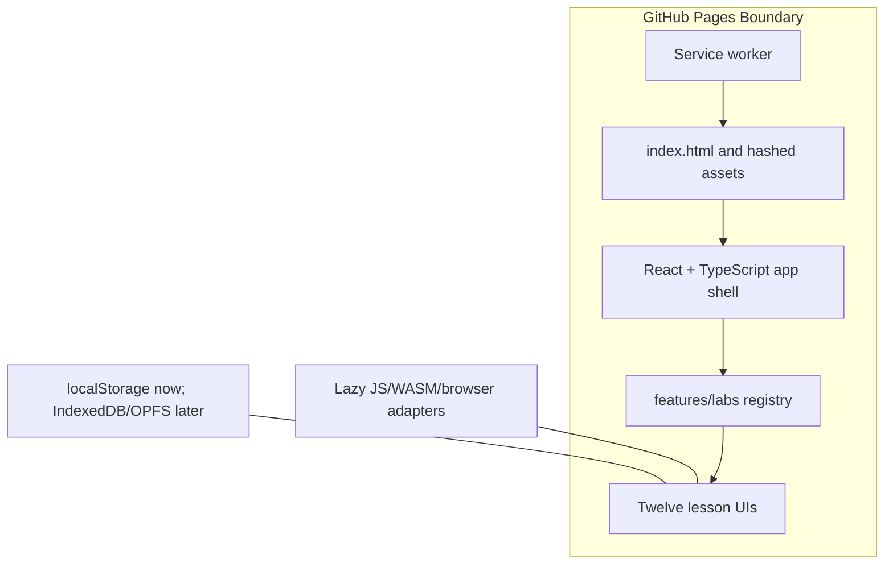

# Architecture

Open School Lab is a static Mode A browser application deployed on GitHub Pages.

Module boundaries:

- `src/features/labs/` owns lab metadata, simulations, and the shared workbench UI.
- `src/lib/` owns shared browser utilities.
- `public/` owns PWA assets copied into the Pages build.
- `docs/` contains authored documentation plus generated Pages output.
